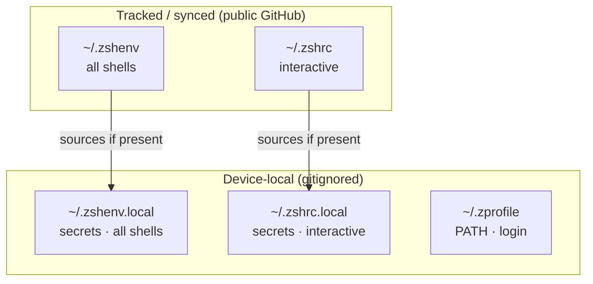
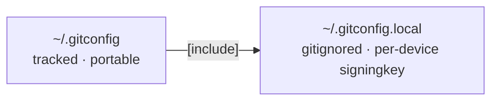

# MacOS Dotfiles & Config

The technique consists in storing a Git bare repository in a "side" folder (like `$HOME/.cfg` or `$HOME/.myconfig`) using a specially crafted alias so that commands are run against that repository and not the usual `.git` local folder, which would interfere with any other Git repositories around.

## Installation

Prior to the installation make sure you have committed the alias to your `.zshrc`:

```bash
alias config='/usr/bin/git --git-dir=$HOME/.cfg/ --work-tree=$HOME'
```

Now clone your dotfiles into a bare repository in a "dot" folder of your

`$HOME`:

```bash
git clone --bare https://github.com/jancbeck/dotfiles $HOME/.cfg
```

Define the alias in the current shell scope:

```bash
alias config='/usr/bin/git --git-dir=$HOME/.cfg/ --work-tree=$HOME'
```

Checkout the actual content from the bare repository to your `$HOME`:

```bash
config checkout
```

The step above might fail with a message like:

```bash
error: The following untracked working tree files would be overwritten by checkout:
    .bashrc
    .gitignore
Please move or remove them before you can switch branches.
Aborting
```

This is because your `$HOME` folder might already have some stock configuration files which would be overwritten by Git. The solution is simple: back up the files if you care about them, remove them if you don't care. A rough shortcut to move all the offending files automatically to a backup folder:

```bash
mkdir -p .config-backup && \
config checkout 2>&1 | egrep "\s+\." | awk {'print $1'} | \
xargs -I{} mv {} .config-backup/{}
```

Re-run the check out if you had problems:

```bash
config checkout
```

Set the flag `showUntrackedFiles` to `no` on this specific (local) repository:

```bash
config config --local status.showUntrackedFiles no
```

### Usage

After you've executed the setup any file within the `$HOME` folder can be versioned with normal commands, replacing `git` with your newly created `config` alias, like:

```bash
config status
config add .vimrc
config commit -m "Add vimrc"
config add .bashrc
config commit -m "Add bashrc"
config push
```

## System Setup

### Workspace

Use a case-sensitive disk image to avoid having to reformat a case-unsensitive system:

1. Open Disk Utility.app
2. File → New Image → Blank image...
3. Name it "_workspace_" in you home directory with these settings:
   1. Format: _APFS (case-sensitive) _
   2. Partitions: _Single Partition - GUID Partition Map_
   3. Image Format: \_sparse bundle disk image
4. Open Automator.app and create a new application
5. Add a "Run Shell Script" action with these contents: `hdiutil attach ~/workspace.dmg.sparsebundle -mountpoint ~/workspace`
6. Save the application and add it to your Login Items in System Settings.

The workspace should now be mounted on system boot at `~/workspace`

Put your projects there, for example:

```
workspace/
├── archive/      # Archived projects and legacy code
├── oss/          # Open source software projects
├── projects/     # Current active projects
└── resources/    # Shared resources and reference materials
```

Add a `.gitconfig`` file for workspace-specific rules (like maintenance).

### Finder

#### Markdown Quick Look

```
brew install --cask qlmarkdown
```

### Shell startup files

Five files, split by **sync scope** (tracked = synced & public; `.local` = device-local & gitignored) and **shell phase** (which zsh startup file sources them). zsh sources them in order: `.zshenv` (always) → `.zprofile` (login shells) → `.zshrc` (interactive shells).

| File | Tracked? | Runs in | Holds |
|------|----------|---------|-------|
| `~/.zshenv` | yes (synced) | **all** shells (incl. non-interactive & scripts) | Minimal always-on env. Points `SSH_AUTH_SOCK` at the Secretive Secure Enclave agent (guarded). Sources `~/.zshenv.local`. No PATH here — macOS `path_helper` reorders it on login shells. |
| `~/.zshenv.local` | no (device-local) | all shells | Secrets/API keys that must reach non-interactive shells (scripts, Claude Code's Bash tool, LaunchAgents). |
| `~/.zprofile` | no (device-local) | login shells | PATH-only env: `brew shellenv`, `pyenv init --path`, `PNPM_HOME`, `BUN_INSTALL`, `NVM_DIR`. |
| `~/.zshrc` | yes (synced via `config` alias) | interactive shells | Cross-device aliases, completions, ssh-agent bootstrap (skipped when Secretive is active). Early-returns for non-interactive shells. Sources `~/.zshrc.local`. |
| `~/.zshrc.local` | no (device-local) | interactive shells | Tokens + interactive init for device-specific tools: `pyenv init -`, `pyenv virtualenv-init -`, `nvm.sh`, bun completion. |



Why the split:
- **Synced vs device-local.** Tracked files are portable and guarded so they no-op on machines missing a tool; `.local` files hold per-device secrets and paths and are gitignored, so the public repo never carries credentials.
- **All shells vs interactive vs login.** Env that must reach *non-interactive* shells — scripts, Claude Code, git subprocesses, LaunchAgents — goes in `.zshenv` (sourced unconditionally). `.zprofile` runs once per login shell (PATH). `.zshrc` runs for interactive shells (aliases, completions) and early-returns otherwise.
- **Why pyenv init is split.** `pyenv init --path` (PATH-only) is in `.zprofile`. The interactive `pyenv init -` and `pyenv virtualenv-init -` live in `.zshrc.local`. If the interactive hooks fire in non-interactive shells — e.g. tmux-resurrect restoring 20 sessions at reboot — they all race for the `~/.pyenv/shims/.pyenv-shim` rehash lock and one stale leftover blocks every future shell with `pyenv: cannot rehash`. Manual recovery: `rm ~/.pyenv/shims/.pyenv-shim`.
- **SSH signing via Secure Enclave.** `.zshenv` sets `SSH_AUTH_SOCK` to [Secretive](https://github.com/maxgoedjen/secretive)'s agent (guarded — no-op without it), so commit signing and SSH auth use a non-exportable Secure Enclave key and no private key ever touches disk. `.zshrc`'s ssh-agent bootstrap loads the on-disk key only when Secretive isn't the active agent.

### Commit signing via Secure Enclave

Commits are signed with an SSH key held in the macOS Secure Enclave through [Secretive](https://github.com/maxgoedjen/secretive). The private key is non-exportable — nothing on the machine (sandboxed or not) can read or copy it; it only signs. `~/.zshenv` points `SSH_AUTH_SOCK` at Secretive's agent socket so signing works in every shell.

**Why the git config is split.** Each machine's enclave key has its own identifier, so the `user.signingkey` path differs per device and must not live in the synced `~/.gitconfig`:

- `~/.gitconfig` (tracked) ends with `[include] path = ~/.gitconfig.local`.
- `~/.gitconfig.local` (gitignored) holds the device-specific signing block: `user.signingkey`, `commit.gpgsign`, `gpg.format = ssh`, `gpg.ssh.allowedSignersFile`.

A machine without `~/.gitconfig.local` simply doesn't sign — git ignores a missing include, so commits don't break.



**New machine setup:**

1. Install Secretive: `brew install --cask secretive`, then open it.
2. Create a Secure Enclave key (the **+**). Leave *"Authenticate before use"* **off** for unattended signing. Secretive writes the public key to `~/Library/Containers/com.maxgoedjen.Secretive.SecretAgent/Data/PublicKeys/<id>.pub`.
3. Add that public key to GitHub → Settings → SSH and GPG keys → New → type **Signing key**.
4. Create `~/.gitconfig.local` (gitignored), replacing the path with your new key's `.pub`:
   ```ini
   [user]
       signingkey = ~/Library/Containers/com.maxgoedjen.Secretive.SecretAgent/Data/PublicKeys/<id>.pub
   [commit]
       gpgsign = true
   [gpg]
       format = ssh
   [gpg "ssh"]
       allowedSignersFile = ~/.config/git/allowed_signers
   ```
5. *(Optional — enables local `git log --show-signature` verification)* create `~/.config/git/allowed_signers` with one line: `<your-git-email> <full contents of the .pub file>`.
6. `SSH_AUTH_SOCK` is already exported by the tracked `~/.zshenv` (guarded), so signing works as soon as Secretive is running. Verify: `git log --show-signature -1` shows `Good "git" signature`.

### Ghostty + tmux: Persistent Terminal Sessions

Claude Code sessions survive Ghostty restarts and reboots via Ghostty + tmux + tmux-resurrect.

**Files:**
- `~/.config/ghostty/config` — keybindings and shell command
- `~/.config/ghostty/persist.sh` — session attach/create logic run on every new tab
- `~/.tmux.conf` — tmux config with plugin setup and Ghostty keybind targets

**How it works:**
- Every Ghostty tab runs `persist.sh` instead of a plain shell
- `persist.sh` attaches to the next free named tmux session (`claude_1`..`claude_20`), or creates one
- tmux-continuum auto-saves session layout every 15 min and auto-restores on tmux server start (after reboot)
- Ghostty keybinds route through the tmux prefix (`Ctrl+B`) so they work even with Claude Code in the foreground

**Keybindings:**

| Key | Action |
|-----|--------|
| `Cmd+T` | New tab → attach to next free session |
| `Cmd+W` | Kill current session and close tab |
| `Cmd+S` | Manually save session layout |
| `Cmd+Shift+T` | Manually restore saved sessions |

**Fresh machine setup:**
1. Clone dotfiles (see Installation above)
2. Install Ghostty and Homebrew tmux: `brew install tmux`
3. Start tmux once: `tmux` — TPM will auto-clone and install all plugins, then exit

## Credits

[Dotfiles: Best way to store in a bare git repository](https://www.atlassian.com/git/tutorials/dotfiles)
