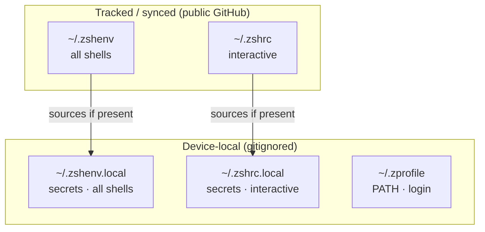
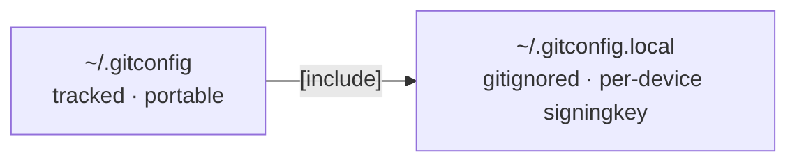

# MacOS Dotfiles & Config

The technique consists in storing a Git bare repository in a "side" folder (like `$HOME/.cfg` or `$HOME/.myconfig`) using a specially crafted alias so that commands are run against that repository and not the usual `.git` local folder, which would interfere with any other Git repositories around.

## Installation

Prior to the installation make sure you have committed the alias to your `.zshrc`:

```bash
alias config='/usr/bin/git --git-dir=$HOME/.cfg/ --work-tree=$HOME'
```

Now clone your dotfiles into a bare repository in a "dot" folder of your

`$HOME`:

```bash
git clone --bare https://github.com/jancbeck/dotfiles $HOME/.cfg
```

Define the alias in the current shell scope:

```bash
alias config='/usr/bin/git --git-dir=$HOME/.cfg/ --work-tree=$HOME'
```

Checkout the actual content from the bare repository to your `$HOME`:

```bash
config checkout
```

The step above might fail with a message like:

```bash
error: The following untracked working tree files would be overwritten by checkout:
    .bashrc
    .gitignore
Please move or remove them before you can switch branches.
Aborting
```

This is because your `$HOME` folder might already have some stock configuration files which would be overwritten by Git. The solution is simple: back up the files if you care about them, remove them if you don't care. A rough shortcut to move all the offending files automatically to a backup folder:

```bash
mkdir -p .config-backup && \
config checkout 2>&1 | egrep "\s+\." | awk {'print $1'} | \
xargs -I{} mv {} .config-backup/{}
```

Re-run the check out if you had problems:

```bash
config checkout
```

Set the flag `showUntrackedFiles` to `no` on this specific (local) repository:

```bash
config config --local status.showUntrackedFiles no
```

### Usage

After you've executed the setup any file within the `$HOME` folder can be versioned with normal commands, replacing `git` with your newly created `config` alias, like:

```bash
config status
config add .vimrc
config commit -m "Add vimrc"
config add .bashrc
config commit -m "Add bashrc"
config push
```

## System Setup

### Packages

`~/Brewfile` is the manifest of everything installed through Homebrew, and it
is what makes the shell config's guarded tool blocks resolve on a new machine.
It lists only top-level installs, so dependencies are left implicit.

```bash
brew bundle install          # install everything in the Brewfile
brew bundle check --verbose  # report what is missing
```

The file is maintained by hand. Most of the casks name applications that were
installed by dragging them to `/Applications`, so Homebrew has no receipt for
them and `brew bundle dump` would drop every one. Use a dump to find drift
rather than to regenerate:

```bash
brew bundle dump --no-vscode --file=/tmp/Brewfile.now
diff /tmp/Brewfile.now ~/Brewfile
```

Adding `--no-vscode` to a dump keeps VS Code extensions out; they churn
whenever an extension updates, and Settings Sync already carries them.

`brew bundle check` reports the untracked applications as missing, because it
asks Homebrew rather than looking in `/Applications`. Running
`brew install --cask --adopt <token>` hands an existing app to Homebrew, but
only adopts in place when the installed version matches the cask exactly;
otherwise it replaces the app with the cask's version.

`brew bundle cleanup` lists formulae that are installed but absent from the
Brewfile; it removes them only with `--force`.

A cask is a GUI application rather than a command-line package, and here it is
a provisioning record first and an update channel second. Homebrew marks any
cask whose app updates itself as `auto_updates`, and `brew upgrade` then leaves
it alone unless called with `--greedy`. Of the casks listed here only
`secretive`, `devcleaner` and the Quick Look plugins are actually upgraded by
Homebrew; the rest keep their own updaters. So the Brewfile is what
puts the applications on a new machine, and it does not take over their
updates.

App Store apps appear as `mas` entries, and only when no cask exists. `mas`
installs what the signed-in Apple ID already owns; it cannot buy an app.

A Brewfile is evaluated as Ruby, so the tracked one ends by loading more files:

| File | Tracked? | Holds |
|------|----------|-------|
| `~/Brewfile` | yes | Everything both machines use |
| `~/Brewfile.work` | yes | Work-only tools: cloud CLIs, Terraform, Zoom |
| `~/Brewfile.personal` | yes | Personal-only apps and tools |
| `~/Brewfile.local` | no | Optional entries for this one machine |

`HOMEBREW_DOTFILES_PROFILE` picks the profile file. It is set to `work` or
`personal` in `~/.zshenv.local`, and `brew bundle` stops with an error when it is
missing. The `HOMEBREW_` prefix is required: `brew` drops other environment
variables before it reads a Brewfile.

`brew bundle install` and `list` cover all of these files. `dump` does not: it
rewrites the Brewfile from what is installed, which drops the loader at the end
and writes the profile entries into the shared file. After a dump, move those
lines back and restore the loader.

Homebrew does not cover everything: the workspace disk image is built by hand,
Touch ID for `sudo` is a PAM file, and system preferences are `defaults write`
calls. Those are the sections below.

A fresh Homebrew install leaves `$(brew --prefix)/share` group-writable, which
makes zsh's `compinit` stop on every new shell with *"Ignore insecure
directories and continue?"*. Clear it once:

```bash
chmod g-w "$(brew --prefix)/share"
```

`compaudit` prints nothing when the directories are safe.

Every command-line tool the shell files reference is in the Brewfile, and each
is behind a `(( $+commands[...] ))` guard so a machine missing one still gets a
working shell:

| Tool | Stands in for | Wired up in |
|------|---------------|-------------|
| `bat` | `cat`, and the man pager | `.zshrc`, `.config/bat/config` |
| `eza` | `ls`, `ll`, `lt` | `.zshrc` |
| `micro` | `nano` | `.zshrc`, `.config/micro/settings.json` |
| `zoxide` | adds `z` and `zi` next to `cd` | `.zshrc` |
| `fzf` | Ctrl-R, Ctrl-T, Alt-C, and `zi`'s picker | `.zshrc` |
| `grc` | colors read-only diagnostic commands | `.zshrc` |
| `git-delta` | the pager for `git diff`, `show`, `log -p` | `.gitconfig` |
| `zsh-autosuggestions`, `zsh-syntax-highlighting` | line editor niceties | `.zshrc` |

### Workspace

Use a case-sensitive disk image to avoid having to reformat a case-unsensitive system:

1. Open Disk Utility.app
2. File → New Image → Blank image...
3. Name it "_workspace_" in you home directory with these settings:
   1. Format: _APFS (case-sensitive) _
   2. Partitions: _Single Partition - GUID Partition Map_
   3. Image Format: \_sparse bundle disk image
4. Open Automator.app and create a new application
5. Add a "Run Shell Script" action with these contents: `hdiutil attach ~/workspace.dmg.sparsebundle -mountpoint ~/workspace`
6. Save the application and add it to your Login Items in System Settings.

The workspace should now be mounted on system boot at `~/workspace`

Put your projects there, for example:

```
workspace/
├── archive/      # Archived projects and legacy code
├── oss/          # Open source software projects
├── projects/     # Current active projects
└── resources/    # Shared resources and reference materials
```

Add a `.gitconfig`` file for workspace-specific rules (like maintenance).

### Finder

#### Markdown Quick Look

```
brew install --cask qlmarkdown
```

### Shell startup files

Five files, split by **sync scope** (tracked = synced & public; `.local` = device-local & gitignored) and **shell phase** (which zsh startup file sources them). zsh sources them in order: `.zshenv` (always) → `.zprofile` (login shells) → `.zshrc` (interactive shells).

| File | Tracked? | Runs in | Holds |
|------|----------|---------|-------|
| `~/.zshenv` | yes (synced) | **all** shells (incl. non-interactive & scripts) | Minimal always-on env. Points `SSH_AUTH_SOCK` at the Secretive Secure Enclave agent (guarded). Sources `~/.zshenv.local`. No PATH here — macOS `path_helper` reorders it on login shells. |
| `~/.zshenv.local` | no (device-local) | all shells | Secrets/API keys that must reach non-interactive shells (scripts, Claude Code's Bash tool, LaunchAgents). |
| `~/.zprofile` | no (device-local) | login shells | PATH-only env: `brew shellenv`, `PNPM_HOME`, `BUN_INSTALL`, `NVM_DIR`, plus the newest installed node's `bin` on PATH (see below). |
| `~/.zshrc` | yes (synced via `config` alias) | interactive shells | Cross-device aliases, cached `compinit`, Docker CLI completions. Early-returns for non-interactive shells. Sources `~/.zshrc.local`. |
| `~/.zshrc.local` | no (device-local) | interactive shells | Tokens + interactive init for device-specific tools: lazy-loaded `nvm.sh`, bun completion. |


```mermaid
flowchart TD
    subgraph tracked["Tracked / synced (public GitHub)"]
        ZE["~/.zshenv<br/>all shells"]
        ZR["~/.zshrc<br/>interactive"]
    end
    subgraph local["Device-local (gitignored)"]
        ZEL["~/.zshenv.local<br/>secrets · all shells"]
        ZRL["~/.zshrc.local<br/>secrets · interactive"]
        ZP["~/.zprofile<br/>PATH · login"]
    end
    ZE -->|sources if present| ZEL
    ZR -->|sources if present| ZRL
```

Why the split:
- **Synced vs device-local.** Tracked files are portable and guarded so they no-op on machines missing a tool; `.local` files hold per-device secrets and paths and are gitignored, so the public repo never carries credentials.
- **All shells vs interactive vs login.** Env that must reach *non-interactive* shells — scripts, Claude Code, git subprocesses, LaunchAgents — goes in `.zshenv` (sourced unconditionally). `.zprofile` runs once per login shell (PATH). `.zshrc` runs for interactive shells (aliases, completions) and early-returns otherwise.
- **SSH signing and auth via Secure Enclave.** `.zshenv` sets `SSH_AUTH_SOCK` to [Secretive](https://github.com/maxgoedjen/secretive)'s agent (guarded — no-op without it), so both commit signing and SSH authentication use a non-exportable Secure Enclave key. No general-purpose private key lives on disk; `~/.ssh` holds only per-host keypairs that a provider issued and the enclave cannot import, such as an AWS `.pem`.

#### Recreating the device-local files

None of the `.local` files or `.zprofile` are in the repository, so a new machine
starts without them. `.zprofile` is the load-bearing one — without it there is no
Homebrew on PATH.

```bash
# ~/.zprofile — PATH only
eval "$(/opt/homebrew/bin/brew shellenv)"

export PNPM_HOME="$HOME/Library/pnpm"
case ":$PATH:" in
  *":$PNPM_HOME/bin:"*) ;;
  *) export PATH="$PNPM_HOME/bin:$PATH" ;;
esac

export BUN_INSTALL="$HOME/.bun"
export PATH="$BUN_INSTALL/bin:$PATH"

export NVM_DIR="$HOME/.nvm"
# see "Node and Python" for the node-on-PATH block
```

```bash
# ~/.zshrc.local — interactive-only, device-specific
# nvm, lazy-loaded: sourcing nvm.sh eagerly costs ~1s
if [ -s "$NVM_DIR/nvm.sh" ]; then
  _load_nvm() {
    unset -f nvm node npm npx _load_nvm
    \. "$NVM_DIR/nvm.sh"
    [ -s "$NVM_DIR/bash_completion" ] && \. "$NVM_DIR/bash_completion"
  }
  for _cmd in nvm node npm npx; do
    eval "${_cmd}() { _load_nvm; ${_cmd} \"\$@\"; }"
  done
fi

[ -s "$HOME/.bun/_bun" ] && source "$HOME/.bun/_bun"
```

```bash
# ~/.zshenv.local — secrets and settings that must reach non-interactive shells
export SOME_API_TOKEN="..."
export HOMEBREW_DOTFILES_PROFILE=personal   # or work; see Packages
```

Installers routinely append to `~/.zshrc` instead, which is tracked and shared —
move anything they add into the matching `.local` file, or into `.zprofile` when
it only sets PATH.

### Node and Python

`nvm` is lazy-loaded from `.zshrc.local` — sourcing `nvm.sh` eagerly costs about a
second. A shell function is invisible to subprocesses, though, so a global CLI with
a `node` shebang (`vercel`, `corepack`) cannot rely on it. `.zprofile` therefore puts
the newest installed node's `bin` on PATH directly, with one `ls`, no sourcing:

```bash
if [ -d "$NVM_DIR/versions/node" ]; then
  _nvm_ver=$(command ls -1 "$NVM_DIR/versions/node" 2>/dev/null | sort -V | tail -1)
  [ -n "$_nvm_ver" ] && export PATH="$NVM_DIR/versions/node/$_nvm_ver/bin:$PATH"
  unset _nvm_ver
fi
```

`nvm use` still overrides it for the current shell.

Python is managed by [uv](https://docs.astral.sh/uv/) (`brew install uv`,
`uv python install 3.13`). There is nothing to activate: `uv run` and `uv sync`
create and use a project's `.venv` on demand, so no shell hook runs on every
prompt. Never build against `/usr/bin/python3` (Apple's) or a Homebrew
`python@3.x` pulled in as another formula's dependency.

pnpm's global config lives at `~/Library/Preferences/pnpm/config.yaml` (tracked).
Putting pnpm-only keys in `~/.npmrc` makes npm warn about unknown config.

### Commit signing via Secure Enclave

Commits are signed with an SSH key held in the macOS Secure Enclave through [Secretive](https://github.com/maxgoedjen/secretive). The private key is non-exportable — nothing on the machine (sandboxed or not) can read or copy it; it only signs. `~/.zshenv` points `SSH_AUTH_SOCK` at Secretive's agent socket so signing works in every shell.

**Why the git config is split.** Each machine's enclave key has its own identifier, so the `user.signingkey` path differs per device and must not live in the synced `~/.gitconfig`:

- `~/.gitconfig` (tracked) ends with `[include] path = ~/.gitconfig.local`.
- `~/.gitconfig.local` (gitignored) holds the device-specific signing block: `user.signingkey`, `commit.gpgsign`, `gpg.format = ssh`, `gpg.ssh.allowedSignersFile`.

A machine without `~/.gitconfig.local` simply doesn't sign — git ignores a missing include, so commits don't break.


```mermaid
flowchart LR
    GC["~/.gitconfig<br/>tracked · portable"] -->|"[include]"| GCL["~/.gitconfig.local<br/>gitignored · per-device signingkey"]
```

**New machine setup:**

1. Install Secretive: `brew install --cask secretive`, then open it.
2. Create a Secure Enclave key (the **+**). Leave *"Authenticate before use"* **off** for unattended signing. Secretive writes the public key to `~/Library/Containers/com.maxgoedjen.Secretive.SecretAgent/Data/PublicKeys/<id>.pub`.
3. Add that public key to GitHub → Settings → SSH and GPG keys **twice**: once as type **Signing key**, once as type **Authentication key**. A signing key does not grant authentication — with only the signing entry, `ssh -T git@github.com` silently falls back to any on-disk key and prompts for its passphrase. Verify which key is accepted with `ssh -v -T git@github.com` and look for `Server accepts key`.
   Do the same for any other host reached over SSH (Azure DevOps, remote boxes' `authorized_keys`).
4. Create `~/.gitconfig.local` (gitignored), replacing the path with your new key's `.pub`:
   ```ini
   [user]
       signingkey = ~/Library/Containers/com.maxgoedjen.Secretive.SecretAgent/Data/PublicKeys/<id>.pub
   [commit]
       gpgsign = true
   [gpg]
       format = ssh
   [gpg "ssh"]
       allowedSignersFile = ~/.config/git/allowed_signers
   ```
5. *(Optional — enables local `git log --show-signature` verification)* create `~/.config/git/allowed_signers` with one line: `<your-git-email> <full contents of the .pub file>`.
6. Create `~/.ssh/config` — it is not tracked, since it names internal hosts and
   provider-issued key paths. The `Host *` block is what points `ssh` itself at
   the enclave agent; without it the enclave key is not offered and `ssh` falls
   back to whatever is on disk:
   ```
   Host *
     AddKeysToAgent yes
     UseKeychain yes
     IdentityAgent ~/Library/Containers/com.maxgoedjen.Secretive.SecretAgent/Data/socket.ssh
   ```
   Per-host blocks below it carry their own `IdentityFile` for keys the enclave
   cannot hold, such as an AWS `.pem`.
7. `SSH_AUTH_SOCK` is already exported by the tracked `~/.zshenv` (guarded), so signing works as soon as Secretive is running. Verify: `git log --show-signature -1` shows `Good "git" signature`.

### Touch ID for sudo

`/etc/pam.d/sudo` already includes `sudo_local`, but that file does not ship.
Creating it from the template enables Touch ID for `sudo`, and it survives OS
updates:

```bash
sudo sh -c 'sed "s/^#auth/auth/" /etc/pam.d/sudo_local.template > /etc/pam.d/sudo_local'
```

The result is one active line: `auth sufficient pam_tid.so`. It does not apply
over SSH.

### Visual Studio Code

Settings Sync carries extensions, settings, and keybindings — sign in and they
return. Only `~/Library/Application Support/Code/User/` matters for a manual
restore: `settings.json`, `keybindings.json`, `snippets/`, `prompts/`, `mcp.json`.
Everything else in that directory is cache.

`brew bundle dump` records extensions too when `--no-vscode` is dropped.

## System preferences

Applied with `defaults write`; each was read back to confirm macOS accepted it.
Finder and Dock keys need `killall Finder Dock` to take effect, and the keyboard
and format keys need a logout.

```bash
# Keyboard — real key repeat when a key is held, faster than the Settings slider
defaults write NSGlobalDomain ApplePressAndHoldEnabled -bool false
defaults write NSGlobalDomain KeyRepeat -int 2
defaults write NSGlobalDomain InitialKeyRepeat -int 15

# Finder
defaults write NSGlobalDomain AppleShowAllExtensions -bool true
defaults write com.apple.finder ShowPathbar -bool true
defaults write com.apple.finder ShowStatusBar -bool true
defaults write com.apple.finder _FXSortFoldersFirst -bool true
defaults write com.apple.finder _FXShowPosixPathInTitle -bool true
defaults write com.apple.finder ProhibitConnectTo -bool true   # drop Go > Connect to Server
defaults write com.apple.finder ProhibitBurn -bool true        # drop Burn Disc

# No .DS_Store on network shares or USB volumes
defaults write com.apple.desktopservices DSDontWriteNetworkStores -bool true
defaults write com.apple.desktopservices DSDontWriteUSBStores -bool true

# Text input — every substitution off. Autocorrect, smart quotes and smart
# dashes all corrupt code, paths and command lines pasted between apps.
defaults write NSGlobalDomain NSAutomaticSpellingCorrectionEnabled -bool false
defaults write NSGlobalDomain NSAutomaticCapitalizationEnabled -bool false
defaults write NSGlobalDomain NSAutomaticDashSubstitutionEnabled -bool false
defaults write NSGlobalDomain NSAutomaticQuoteSubstitutionEnabled -bool false
defaults write NSGlobalDomain NSAutomaticPeriodSubstitutionEnabled -bool false

# Pointer — tracking speed well above the midpoint of the Settings slider
defaults write NSGlobalDomain com.apple.trackpad.scaling -float 3

# Dock — hidden until the pointer reaches the edge, icons a little larger than
# stock. Stop reordering Spaces by recency, which makes keyboard window
# managers unpredictable; dim the icons of hidden applications
defaults write com.apple.dock autohide -bool true
defaults write com.apple.dock tilesize -int 57
defaults write com.apple.dock mru-spaces -bool false
defaults write com.apple.dock showhidden -bool true

# Finder opens in list view
defaults write com.apple.finder FXPreferredViewStyle -string Nlsv

# Menu bar clock — weekday and time, no date
defaults write com.apple.menuextra.clock ShowDayOfWeek -bool true
defaults write com.apple.menuextra.clock ShowDate -int 0

# Screenshots to ~/Downloads as PNG, drop shadow kept
defaults write com.apple.screencapture location -string "$HOME/Downloads"
defaults write com.apple.screencapture type -string png

# Windows and dialogs
defaults write NSGlobalDomain NSNavPanelExpandedStateForSaveMode -bool true
defaults write NSGlobalDomain AppleEdgeResizeExteriorSize -int 10

# Show a crash report when an application crashes
defaults write com.apple.CrashReporter DialogType -string developer

# ISO dates, period as decimal separator, no thousands grouping
defaults write NSGlobalDomain AppleICUDateFormatStrings -dict 1 "y-MM-dd" 2 "y-MM-dd"
defaults write NSGlobalDomain AppleICUNumberSymbols -dict 0 "." 1 "" 10 "." 17 ""
```

The screenshot location moved out of TinkerTool once Apple made it a first-class
setting — it is under Cmd+Shift+5 → Options → Save to.

Two settings have no user-preference key to record. **Power button: press and
release sleeps the machine** was set in TinkerTool and is not visible in any
`defaults` domain. **Currency in euro** follows from `AppleLocale = en_AT`
rather than an explicit `AppleICUCurrencyCode`.

### Settings `defaults write` cannot set

Three of these are readable but not writable from a script, so each is a click
path with the key to verify it afterwards.

**Caps Lock sends Control.** Set per keyboard under Settings → Keyboard →
Keyboard Shortcuts → Modifier Keys, once for the built-in keyboard and once for
each external one. It lands in a per-device key whose name carries the USB
vendor and product ID, so the exact key differs between machines:

```bash
defaults -currentHost read -g | grep -A5 modifiermapping
```

`Src = 30064771129` is `0x700000039`, the Caps Lock usage, and
`Dst = 30064771300` is `0x7000000E0`, left Control. A `0-0-0` entry covers
keyboards with no more specific mapping.

**Zoom the whole display with Control and the scroll wheel.** Settings →
Accessibility → Zoom → *Use scroll gesture with modifier keys to zoom*, with
Control as the key. `com.apple.universalaccess` is protected by TCC, so
`defaults write` fails with *"Could not write domain"* unless the calling
program holds Full Disk Access. Verify:

```bash
defaults read com.apple.universalaccess closeViewScrollWheelToggle   # 1
defaults read com.apple.universalaccess HIDScrollZoomModifierMask    # 262144 = Control
```

**Time Machine exclusions.** There is no verb that lists them; `tmutil` only
answers about paths handed to it, and needs Full Disk Access to answer at all:

```bash
tmutil isexcluded ~/workspace ~/Library/Caches
tmutil addexclusion -p <path>     # -p makes it stick to the path, not the inode
```

`~/workspace` is excluded, since it is a mount point for the disk image.
`~/workspace.dmg.sparsebundle` is **not** excluded, so the projects inside it
are backed up through the bundle itself rather than through the mount.

### micro

`keymenu` keeps nano's two rows of shortcuts pinned to the bottom of the
window, which is the only reason nano never needed learning. The menu is
generated from micro's own defaults and ignores `bindings.json`, so the
keybindings are left stock: a remapped key would make the menu lie.

`Alt-g` toggles the menu, and `Alt` bindings need the terminal to send Option
as Meta. In Ghostty that is `macos-option-as-alt`; `left` keeps the right
Option key free for typing `@` and `€` on an Austrian layout. The same setting
is what makes fzf's `Alt-C` work.

### Window management

macOS 26 tiles windows on its own — halves, quarters and fill, under Settings →
Desktop & Dock → Windows, with shortcuts in Keyboard Shortcuts. What it does not
do is send a window to the next display when the same shortcut is pressed again,
and that is the reason Rectangle is here.

Rectangle stores a shortcut as a virtual key code plus a modifier mask. The mask
is the sum of Shift `131072`, Control `262144`, Option `524288` and Command
`1048576`, so Command-Shift is `1179648`. Key codes are physical positions, not
letters, so they hold across keyboard layouts: `F` is 3, `1` is 18, `2` is 19.

```bash
osascript -e 'tell application "Rectangle" to quit'   # it owns its prefs while running
defaults write com.knollsoft.Rectangle maximize  -dict keyCode -int 3  modifierFlags -int 1179648
defaults write com.knollsoft.Rectangle leftHalf  -dict keyCode -int 18 modifierFlags -int 1179648
defaults write com.knollsoft.Rectangle rightHalf -dict keyCode -int 19 modifierFlags -int 1179648
defaults write com.knollsoft.Rectangle subsequentExecutionMode -int 1
open -a Rectangle
```

`subsequentExecutionMode` decides what a repeated press does. `1` is
`acrossMonitor`, which moves the window to the same position on the next
display, so Command-Shift-F twice maximises on the other screen and a third
press brings it back. The other values are `0` resize, `2` nothing,
`3` across then resize, `4` cycle monitors, `5` resize and cycle quadrants.

Rectangle needs Accessibility permission, without which the shortcuts are
registered but do nothing. Its menu bar icon is hidden here
(`hideMenubarIcon = 1`), so reach settings by launching the app again.

Two shortcuts are macOS's own rather than Rectangle's:

| Keys | What | Where |
|------|------|-------|
| Command and the key below Escape | Cycle windows of the focused app | Symbolic hotkey 27, set to key code 50 with modifier `1048576` |
| Option-Tab | AltTab's window switcher with previews | AltTab's own default, which leaves Command-Tab as macOS's |

Symbolic hotkey 27 is readable with
`defaults read com.apple.symbolichotkeys AppleSymbolicHotKeys`, though it is set
through Settings → Keyboard → Keyboard Shortcuts → Keyboard.

### Menu bar and pointer

| App | Purpose | Install |
|-----|---------|---------|
| [Hidden Bar](https://github.com/dwarvesf/hidden) | Collapses menu bar items behind an arrow | Manual, from GitHub releases |
| [LinearMouse](https://linearmouse.app) | Per-device pointer acceleration and button mapping | `brew install --cask linearmouse` |

LinearMouse keeps its configuration in `~/.config/linearmouse/linearmouse.json`
(tracked), keyed by USB vendor and product ID, so a device it does not
recognise falls back to the system setting.

Hidden Bar is in the Brewfile's territory but not in the Brewfile: the
`hiddenbar` cask points at a GitHub release asset that returns 404, so the
install has to be manual until upstream fixes it.

## Credits

[Dotfiles: Best way to store in a bare git repository](https://www.atlassian.com/git/tutorials/dotfiles)
