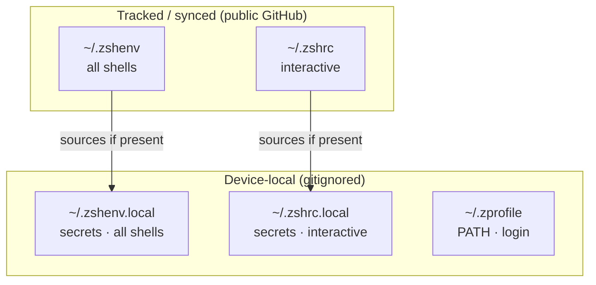
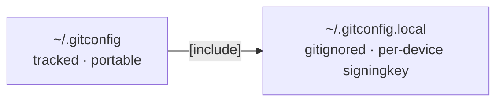

# MacOS Dotfiles & Config

The technique consists in storing a Git bare repository in a "side" folder (like `$HOME/.cfg` or `$HOME/.myconfig`) using a specially crafted alias so that commands are run against that repository and not the usual `.git` local folder, which would interfere with any other Git repositories around.

## Installation

Prior to the installation make sure you have committed the alias to your `.zshrc`:

```bash
alias config='/usr/bin/git --git-dir=$HOME/.cfg/ --work-tree=$HOME'
```

Now clone your dotfiles into a bare repository in a "dot" folder of your

`$HOME`:

```bash
git clone --bare https://github.com/jancbeck/dotfiles $HOME/.cfg
```

Define the alias in the current shell scope:

```bash
alias config='/usr/bin/git --git-dir=$HOME/.cfg/ --work-tree=$HOME'
```

Checkout the actual content from the bare repository to your `$HOME`:

```bash
config checkout
```

The step above might fail with a message like:

```bash
error: The following untracked working tree files would be overwritten by checkout:
    .bashrc
    .gitignore
Please move or remove them before you can switch branches.
Aborting
```

This is because your `$HOME` folder might already have some stock configuration files which would be overwritten by Git. The solution is simple: back up the files if you care about them, remove them if you don't care. A rough shortcut to move all the offending files automatically to a backup folder:

```bash
mkdir -p .config-backup && \
config checkout 2>&1 | egrep "\s+\." | awk {'print $1'} | \
xargs -I{} mv {} .config-backup/{}
```

Re-run the check out if you had problems:

```bash
config checkout
```

Set the flag `showUntrackedFiles` to `no` on this specific (local) repository:

```bash
config config --local status.showUntrackedFiles no
```

### Usage

After you've executed the setup any file within the `$HOME` folder can be versioned with normal commands, replacing `git` with your newly created `config` alias, like:

```bash
config status
config add .vimrc
config commit -m "Add vimrc"
config add .bashrc
config commit -m "Add bashrc"
config push
```

## System Setup

### Workspace

Use a case-sensitive disk image to avoid having to reformat a case-unsensitive system:

1. Open Disk Utility.app
2. File → New Image → Blank image...
3. Name it "_workspace_" in you home directory with these settings:
   1. Format: _APFS (case-sensitive) _
   2. Partitions: _Single Partition - GUID Partition Map_
   3. Image Format: \_sparse bundle disk image
4. Open Automator.app and create a new application
5. Add a "Run Shell Script" action with these contents: `hdiutil attach ~/workspace.dmg.sparsebundle -mountpoint ~/workspace`
6. Save the application and add it to your Login Items in System Settings.

The workspace should now be mounted on system boot at `~/workspace`

Put your projects there, for example:

```
workspace/
├── archive/      # Archived projects and legacy code
├── oss/          # Open source software projects
├── projects/     # Current active projects
└── resources/    # Shared resources and reference materials
```

Add a `.gitconfig`` file for workspace-specific rules (like maintenance).

### Finder

#### Markdown Quick Look

```
brew install --cask qlmarkdown
```

### Shell startup files

Five files, split by **sync scope** (tracked = synced & public; `.local` = device-local & gitignored) and **shell phase** (which zsh startup file sources them). zsh sources them in order: `.zshenv` (always) → `.zprofile` (login shells) → `.zshrc` (interactive shells).

| File | Tracked? | Runs in | Holds |
|------|----------|---------|-------|
| `~/.zshenv` | yes (synced) | **all** shells (incl. non-interactive & scripts) | Minimal always-on env. Points `SSH_AUTH_SOCK` at the Secretive Secure Enclave agent (guarded). Sources `~/.zshenv.local`. No PATH here — macOS `path_helper` reorders it on login shells. |
| `~/.zshenv.local` | no (device-local) | all shells | Secrets/API keys that must reach non-interactive shells (scripts, Claude Code's Bash tool, LaunchAgents). |
| `~/.zprofile` | no (device-local) | login shells | PATH-only env: `brew shellenv`, `PNPM_HOME`, `BUN_INSTALL`, `NVM_DIR`, plus the newest installed node's `bin` on PATH (see below). |
| `~/.zshrc` | yes (synced via `config` alias) | interactive shells | Cross-device aliases, cached `compinit`, Docker CLI completions. Early-returns for non-interactive shells. Sources `~/.zshrc.local`. |
| `~/.zshrc.local` | no (device-local) | interactive shells | Tokens + interactive init for device-specific tools: lazy-loaded `nvm.sh`, bun completion. |


```mermaid
flowchart TD
    subgraph tracked["Tracked / synced (public GitHub)"]
        ZE["~/.zshenv<br/>all shells"]
        ZR["~/.zshrc<br/>interactive"]
    end
    subgraph local["Device-local (gitignored)"]
        ZEL["~/.zshenv.local<br/>secrets · all shells"]
        ZRL["~/.zshrc.local<br/>secrets · interactive"]
        ZP["~/.zprofile<br/>PATH · login"]
    end
    ZE -->|sources if present| ZEL
    ZR -->|sources if present| ZRL
```

Why the split:
- **Synced vs device-local.** Tracked files are portable and guarded so they no-op on machines missing a tool; `.local` files hold per-device secrets and paths and are gitignored, so the public repo never carries credentials.
- **All shells vs interactive vs login.** Env that must reach *non-interactive* shells — scripts, Claude Code, git subprocesses, LaunchAgents — goes in `.zshenv` (sourced unconditionally). `.zprofile` runs once per login shell (PATH). `.zshrc` runs for interactive shells (aliases, completions) and early-returns otherwise.
- **SSH signing and auth via Secure Enclave.** `.zshenv` sets `SSH_AUTH_SOCK` to [Secretive](https://github.com/maxgoedjen/secretive)'s agent (guarded — no-op without it), so both commit signing and SSH authentication use a non-exportable Secure Enclave key. No general-purpose private key lives on disk; `~/.ssh` holds only per-host keypairs that a provider issued and the enclave cannot import, such as an AWS `.pem`.

### Node and Python

`nvm` is lazy-loaded from `.zshrc.local` — sourcing `nvm.sh` eagerly costs about a
second. A shell function is invisible to subprocesses, though, so a global CLI with
a `node` shebang (`vercel`, `corepack`) cannot rely on it. `.zprofile` therefore puts
the newest installed node's `bin` on PATH directly, with one `ls`, no sourcing:

```bash
if [ -d "$NVM_DIR/versions/node" ]; then
  _nvm_ver=$(command ls -1 "$NVM_DIR/versions/node" 2>/dev/null | sort -V | tail -1)
  [ -n "$_nvm_ver" ] && export PATH="$NVM_DIR/versions/node/$_nvm_ver/bin:$PATH"
  unset _nvm_ver
fi
```

`nvm use` still overrides it for the current shell.

Python is managed by [uv](https://docs.astral.sh/uv/) (`brew install uv`,
`uv python install 3.13`). There is nothing to activate: `uv run` and `uv sync`
create and use a project's `.venv` on demand, so no shell hook runs on every
prompt. Never build against `/usr/bin/python3` (Apple's) or a Homebrew
`python@3.x` pulled in as another formula's dependency.

pnpm's global config lives at `~/Library/Preferences/pnpm/config.yaml` (tracked).
Putting pnpm-only keys in `~/.npmrc` makes npm warn about unknown config.

### Commit signing via Secure Enclave

Commits are signed with an SSH key held in the macOS Secure Enclave through [Secretive](https://github.com/maxgoedjen/secretive). The private key is non-exportable — nothing on the machine (sandboxed or not) can read or copy it; it only signs. `~/.zshenv` points `SSH_AUTH_SOCK` at Secretive's agent socket so signing works in every shell.

**Why the git config is split.** Each machine's enclave key has its own identifier, so the `user.signingkey` path differs per device and must not live in the synced `~/.gitconfig`:

- `~/.gitconfig` (tracked) ends with `[include] path = ~/.gitconfig.local`.
- `~/.gitconfig.local` (gitignored) holds the device-specific signing block: `user.signingkey`, `commit.gpgsign`, `gpg.format = ssh`, `gpg.ssh.allowedSignersFile`.

A machine without `~/.gitconfig.local` simply doesn't sign — git ignores a missing include, so commits don't break.


```mermaid
flowchart LR
    GC["~/.gitconfig<br/>tracked · portable"] -->|"[include]"| GCL["~/.gitconfig.local<br/>gitignored · per-device signingkey"]
```

**New machine setup:**

1. Install Secretive: `brew install --cask secretive`, then open it.
2. Create a Secure Enclave key (the **+**). Leave *"Authenticate before use"* **off** for unattended signing. Secretive writes the public key to `~/Library/Containers/com.maxgoedjen.Secretive.SecretAgent/Data/PublicKeys/<id>.pub`.
3. Add that public key to GitHub → Settings → SSH and GPG keys **twice**: once as type **Signing key**, once as type **Authentication key**. A signing key does not grant authentication — with only the signing entry, `ssh -T git@github.com` silently falls back to any on-disk key and prompts for its passphrase. Verify which key is accepted with `ssh -v -T git@github.com` and look for `Server accepts key`.
   Do the same for any other host reached over SSH (Azure DevOps, remote boxes' `authorized_keys`).
4. Create `~/.gitconfig.local` (gitignored), replacing the path with your new key's `.pub`:
   ```ini
   [user]
       signingkey = ~/Library/Containers/com.maxgoedjen.Secretive.SecretAgent/Data/PublicKeys/<id>.pub
   [commit]
       gpgsign = true
   [gpg]
       format = ssh
   [gpg "ssh"]
       allowedSignersFile = ~/.config/git/allowed_signers
   ```
5. *(Optional — enables local `git log --show-signature` verification)* create `~/.config/git/allowed_signers` with one line: `<your-git-email> <full contents of the .pub file>`.
6. `SSH_AUTH_SOCK` is already exported by the tracked `~/.zshenv` (guarded), so signing works as soon as Secretive is running. Verify: `git log --show-signature -1` shows `Good "git" signature`.

## System preferences

Applied with `defaults write`; each was read back to confirm macOS accepted it.
Finder and Dock keys need `killall Finder Dock` to take effect, and the keyboard
and format keys need a logout.

```bash
# Keyboard — real key repeat when a key is held, faster than the Settings slider
defaults write NSGlobalDomain ApplePressAndHoldEnabled -bool false
defaults write NSGlobalDomain KeyRepeat -int 2
defaults write NSGlobalDomain InitialKeyRepeat -int 15

# Finder
defaults write NSGlobalDomain AppleShowAllExtensions -bool true
defaults write com.apple.finder ShowPathbar -bool true
defaults write com.apple.finder ShowStatusBar -bool true
defaults write com.apple.finder _FXSortFoldersFirst -bool true
defaults write com.apple.finder _FXShowPosixPathInTitle -bool true
defaults write com.apple.finder ProhibitConnectTo -bool true   # drop Go > Connect to Server
defaults write com.apple.finder ProhibitBurn -bool true        # drop Burn Disc

# No .DS_Store on network shares or USB volumes
defaults write com.apple.desktopservices DSDontWriteNetworkStores -bool true
defaults write com.apple.desktopservices DSDontWriteUSBStores -bool true

# Dock — stop reordering Spaces by recency, which makes keyboard window
# managers unpredictable; dim the icons of hidden applications
defaults write com.apple.dock mru-spaces -bool false
defaults write com.apple.dock showhidden -bool true

# Screenshots to ~/Downloads as PNG, drop shadow kept
defaults write com.apple.screencapture location -string "$HOME/Downloads"
defaults write com.apple.screencapture type -string png

# Windows and dialogs
defaults write NSGlobalDomain NSNavPanelExpandedStateForSaveMode -bool true
defaults write NSGlobalDomain AppleEdgeResizeExteriorSize -int 10

# Show a crash report when an application crashes
defaults write com.apple.CrashReporter DialogType -string developer

# ISO dates, period as decimal separator, no thousands grouping
defaults write NSGlobalDomain AppleICUDateFormatStrings -dict 1 "y-MM-dd" 2 "y-MM-dd"
defaults write NSGlobalDomain AppleICUNumberSymbols -dict 0 "." 1 "" 10 "." 17 ""
```

The screenshot location moved out of TinkerTool once Apple made it a first-class
setting — it is under Cmd+Shift+5 → Options → Save to.

Two settings have no user-preference key to record. **Power button: press and
release sleeps the machine** was set in TinkerTool and is not visible in any
`defaults` domain. **Currency in euro** follows from `AppleLocale = en_AT`
rather than an explicit `AppleICUCurrencyCode`.

## Credits

[Dotfiles: Best way to store in a bare git repository](https://www.atlassian.com/git/tutorials/dotfiles)
